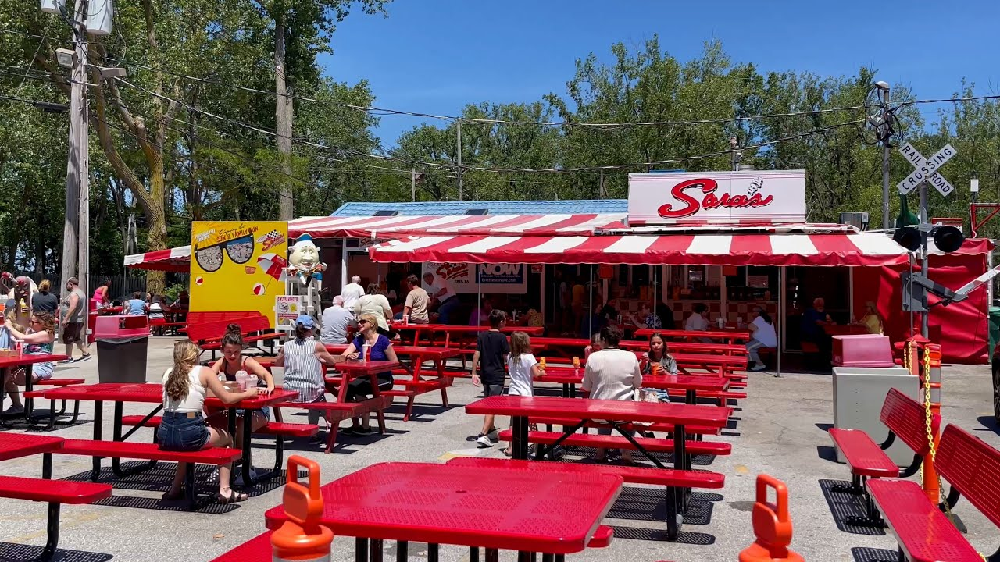

Want to explore the area during your visit? Here is your one stop shop to all things you have to do and/or try during your time in Erie, Pennsylvania!

## Places

### <a href="https://www.erieartmuseum.org/">Erie Art Museum</a>

Erie's Art Museum is the perfect place to experience remarkable art pieces from both local and world-famous artists. With over 8,000 objects, there is something for everyone to enjoy.

<strong>Website:</strong> <a href="https://www.erieartmuseum.org/" target="_blank">https://www.erieartmuseum.org/</a>

<strong>Phone:</strong> (814) 459-5477

<strong>Address:</strong> <a href="https://www.google.com/maps/place/Erie+Art+Museum/@42.1310444,-80.0880209,17z/data=!3m1!4b1!4m6!3m5!1s0x882d7fe545495e93:0x24059a439df897ed!8m2!3d42.1310444!4d-80.085446!16s%2Fm%2F027td4s?entry=ttu" target="_blank">20 East 5th Street, Erie, PA 16507</a>

<strong>Hours:</strong>
<ul>
<li>Sat: 10:00AM-5:00PM</li>
<li>Sun: 1:00PM-6:00PM</li>
<li>Mon-Tue: Closed</li>
<li>Wed-Fri: 11:00AM-6:00PM</li>
</ul>

<figure class="loc">
<figcaption>Erie Art Museum</figcaption>
</figure>
<figure class="loc">

<figcaption>Inside the Erie Art Museum</figcaption>
</figure>

### <a href="https://blog.feed.art/" target="_blank">FEED Media Arts Center</a>

Downtown Erie's prime destination for innovation, exhibition, education, and preservation of media art. Experience their collections, including Eclipsing Stars, Ether.exe, or Mirror Me!

<strong>Website:</strong> <a href="https://blog.feed.art/" target="_blank">https://blog.feed.art/</a>

<strong>Phone:</strong> +1 (814) 240-1080

<strong>Address:</strong> <a href="https://www.google.com/maps/place/FEED+Media+Art+Center/@42.1224485,-80.0826709,17z/data=!4m15!1m8!3m7!1s0x882d7fe1eaa4e707:0xf80b079a57a93ca0!2s1307+State+St,+Erie,+PA+16501!3b1!8m2!3d42.1224485!4d-80.080096!16s%2Fg%2F11c11mc0hn!3m5!1s0x882d7fb445407deb:0x24abf7be8eb04761!8m2!3d42.1224484!4d-80.0800959!16s%2Fg%2F11pyc3nm1g?entry=ttu" target="_blank">1307 State St, Erie, PA 16501</a>

<strong>Hours:</strong>
<ul>
<li>Wed. May 22 (after the conference): 2 - 4pm</li>
<li>Fri: 5:00PM-8:00PM</li>
<li>Sat-Sun: 12:00PM-5:00PM</li>
</ul>

<figure class="loc">
<figcaption>FEED Media Arts Center</figcaption>
</figure>
<figure class="loc">

<figcaption>Eclipse Week at FEED</figcaption>
</figure>

### The Waterfront and Presque Isle
Visit the lakefront in downtown Erie, and make a trip out on the peninsula of Presque Isle! 
Check out [these 15 recommended activities at Presque Isle](https://uncoveringpa.com/things-to-do-presque-isle-state-park-erie-pa) from travel site *Uncovering PA*.

<figure class="loc">
<figcaption>aerial view of Presque Isle jutting onto Lake Erie. Photo by Ken Winters, U.S. Army Corps of Engineers Digital Visual Library.</figcaption>
</figure>

## Food

### [Erie Brewing Company](https://www.eriebrewingco.com/knowledge-park-tap.html) and [John's Wildwood pub & pie](https://www.eriebrewingco.com/knowledge-park.html/#johns) (at Knowledge Park near campus)

Located close to the Penn State Behrend campus, the Erie Brewing Company is a local favorite, with  some amazing beverages brewed on site, from craft sodas to ales, IPAs, to stouts. You can take a tour of the brewery, and also order  pizza, Buffalo wings, hoagies (all loved in this region) from John's Wildwood <q>pub & pie</q> restaurant next door / attached. This is where Behrend people (of age) go to celebrate surviving a tough week! 

**Knowledge Park location**

* 6008 Knowledge Pkwy, Erie, PA 16150
* Hours:
    * Monday - Thursday: 11:30am - 10pm 
    * Friday - Saturday: 11:30am - 11pm 
    * Sunday: 11:30am - 9:30pm
  
<figure class="loc">

<figcaption>Erie Brewing Company and the Pub &amp; Pie</figcaption>
</figure>

### [The Brewerie](https://www.brewerie.com/index.html) (at Union Station, downtown Erie)

Erie's first craft brew pub, located in our historic train station, visited on <q>whistle stop</q> tours by several presidents as well as sports icons Babe Ruth and Jack Dempsey! They say the station is haunted by the ghosts of past travelers, but we just love the food and craft beverages at the Brewerie as a fine experience of Erie. 

* 123 W 14th Street, Erie, PA 16501-1717
* Hours:
    * Monday-Thursday 11:30-9pm
    * Friday & Saturday 11:30-11pm 
    * Closed Sundays & All Major Holidays

<figure class="loc">

<figcaption>the spacious train station dining area of the Brewerie</figcaption>
</figure>

### <a href="https://eriefood.coop/home">Erie Food Co-op and Co-op Cafe</a>
Community-owned grocery store and deli with sit-down cafe. (No membership required.) There are two locations in Erie, but the one with the cafe is on 26th street.

**Address and Hours**

* 1341 W. 26th Street, Erie, PA 16508</li>
* Mon - Sat 8am - 8pm, Sun 10am - 8pm</li>

<figure class="loc">

<figcaption>Cafe in the Erie Food Co-op</figcaption>
</figure>

### [Flagship City Food Hall](https://www.flagshipcitydistrict.com/foodhall)

There's such a multitude of small international foods served here! You can feast on Dominican empañadas, Asian fusion glass noodles and kimchi, shawarma, and so much more, and if you wander in here for dinner from 6 -8pm, you will likely hear some live entertainment! (Monday is Trivia Night and Tuesday is Karaoke Night!)

* Address: 22 N Park Row, Erie, PA 16501
* Hours: open daily until 8pm

<figure class="loc">

<figcaption>Flagship City Food Hall when it first opened on November 20, 2022, showing some characteristic Erie snowfall in the foreground! Image Credit: [Modern Mary](https://www.amodernmary.com/2022/03/erie-local-spotlight-flagship-city-food.html)</figcaption>
</figure>

### [Fine Restaurant & Bar](https://restaurantguru.com/Fine-Restaurant-and-Bar-Erie)

Amazing Indian and Nepalese food—preferred by our colleagues! Their web presence is not the best, so you may want to verify the hours when you're here.

* Address: 2330 E 38th St., Erie PA 16510
* (814) 520-5112
* Hours (est.): 
    * Closed Monday
    * Tues. - Sun. 11am - 2:30pm, 4:30 - 9:30pm
  
<figure class="loc">

<figcaption>Sampling of cuisine from the Fine Restaurant. Image Credit: Fine Restaurant on Facebook</figcaption>
</figure>

### [Saigon Nights](https://www.saigonnightserie.com/)
Authentic and absolutely delicious Vietnamese cuisine near the Lake. Feast yourself on marvelous pho! (It's not dining in view of the lake, but you'll find yourself near the waterfront there.) 

* Hours
    *  Sun & Mon:	11:00 AM - 9:30 PM 
    * Tue:	11:00 AM - 9:00 PM 
    * Wed:	11:00 AM - 9:30 PM 
    * Thu - Sat:	11:00 AM - 10:00 PM

<figure class="loc">

<figcaption>Saigon Nights Restaurant. Image Credit: Saigon Nights on Facebook</figcaption>
</figure>

### <a href="https://sarasandsallys.com/">Saras</a>

<strong>Website:</strong> <a href="https://sarasandsallys.com/" target="_blank">https://sarasandsallys.com/</a>

<strong>Phone:</strong> (814) 833-1957'

<strong>Address:</strong> <a href="https://www.google.com/maps/place/Sara's+Restaurant/@42.1123065,-80.1555349,17z/data=!4m15!1m8!3m7!1s0x88327f6de5b42479:0xb638bbb8f5da29ec!2sSara's+Restaurant!8m2!3d42.112558!4d-80.155184!10e5!16s%2Fg%2F1v9t_kdb!3m5!1s0x88327f6de5b42479:0xb638bbb8f5da29ec!8m2!3d42.112558!4d-80.155184!16s%2Fg%2F1v9t_kdb?entry=ttu" target="_blank">25 Peninsula Dr, Erie, PA 16505</a>

**Hours**

* Every Day: 11:00AM-8:00PM

Looking for a place to eat Presque Isle State Park? Try Sara's! With lovely outdoor seating, you can enjoy the (hopefully) warm weather while trying their tasty milkshakes or ice cream!

<figure class="loc">

<figcaption>Sara’s outdoor seating</figcaption>
</figure>
<figure class="loc">

<figcaption>Indoors at Sara’s</figcaption>
</figure>

### <a href="https://www.stanganellis.com/">Stanganelli’s Italian Food</a>

Ever heard of Erie's iconic Pepperoni Balls? Their claim to fame comes from Stanganelli's, a family owned Italian restaurant. Not a fan of pepperoni? Not a problem! They also have amazing calzones, meatballs, various pastas, sauces, and assorted breads.

<strong>Website:</strong> <a href="https://www.stanganellis.com/" target="_blank">https://www.stanganellis.com/</a>

<strong>Phone:</strong> 814-459-0101

<strong>Address:</strong> <a href="https://www.google.com/maps/place/Stanganelli's/@42.0985461,-80.1089643,17z/data=!4m15!1m8!3m7!1s0x88327fdb4d0e4a55:0xb0f9aeb15f896a8c!2s1621+W+26th+St,+Erie,+PA+16508!3b1!8m2!3d42.0985461!4d-80.1089643!16s%2Fg%2F11dfh3fj9s!3m5!1s0x88327fdb52a4f025:0x1d57c60df0535ef6!8m2!3d42.0984787!4d-80.109027!16s%2Fg%2F11cknjz_fp?entry=ttu" target="_blank">1621 West 26th Street, Erie, PA 16508</a>

<strong>Hours:</strong>
<ul>
<li>Sun-Mon: Closed</li>
<li>Tue-Fri: 11:00AM-6:00PM</li>
<li>Sat: 11:00AM-4:00PM</li>
</ul>

<figure class="loc">

</figure>
<figure class="loc">

</figure>

### <a href="https://romolochocolates.com/">Romolo Chocolates</a>

Romolo Chocolates is the perfect place to add to your to-do list. For over 28 years, they have been making their delicious deserts to satisfy every person's sweet tooth. Be sure to try their famous and uniquely crafted Sponge Candy, which continues to be a fan favorite of Erieites and tourists alike!

<figure class="loc">

<figcaption>Wondering what even is “sponge candy“? Here's a cross-section!</figcaption>
</figure>
<strong>Website:</strong> <a href="https://romolochocolates.com/" target="_blank">https://romolochocolates.com/</a>

<strong>Phone:</strong> 814-452-1933

<strong>Address:</strong> <a href="https://www.google.com/maps/place/Romolo+Chocolates/@42.1144886,-80.1171228,17z/data=!4m15!1m8!3m7!1s0x88327fed864e638f:0x78b38809afd20f38!2s1525+W+8th+St,+Erie,+PA+16505!3b1!8m2!3d42.1144886!4d-80.1171228!16s%2Fg%2F11bw4bwz80!3m5!1s0x88327ff26c4c3365:0x9e88295707542b53!8m2!3d42.114565!4d-80.117162!16s%2Fg%2F1tjfhhjh?entry=ttu" target="_blank">1525 West 8th Street, Erie, PA 16505</a>

<strong>Hours:</strong>
<ul>
<li>Mon-Fri: 8:00AM-8:00PM</li>
<li>Sat: 9:00AM-8:00PM</li>
<li>Sun: 10:00AM-5:00PM</li>
</ul>
<figure class="loc">

</figure>

### <a href="https://www.smithhotdogs.com/">Smith's Hot Dogs</a>

Although there is no specific restaurant in Erie with this, Smith's hot dogs are Erie's favorite! From Smith Provision Co., Inc., their skillfully crafted weiners, sausages, deli meats, bacon and hams have been a staple in Erie culture for four generations. You can buy these at most restaurants that serve hot dogs or grocery store!

<figure class="loc">

</figure>

