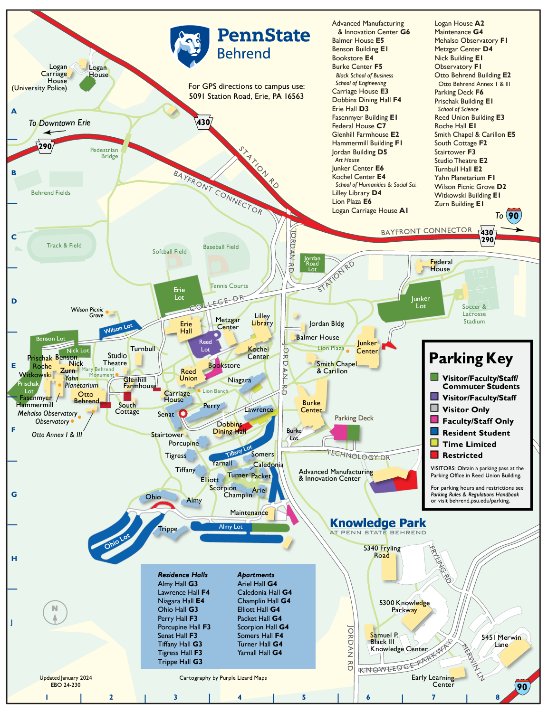

## Registration

Registration for Keystone DH 2024 is now live!

<a href="https://forms.bd.psu.edu/keystone-dh-registration" target="_blank">Register here</a> to attend the Keystone DH 2024 Conference May 20 - 22, 2024. Note: This involves filling out and clicking through multiple screens, and may pay for registration with a credit or debit card.

Prices (NOT including housing)
<ul id="regPrice">

<li>Students or part-time rate: $30</li>

<li>Employed or full-time rate: $70</li>
</ul>

 

## Venue and Travel Information

Keystone DH 2024 is hosted on the campus of <a href="https://behrend.psu.edu/" target="_blank">Penn State Erie, The Behrend College</a>.

### How to Travel to Penn State Erie

[The campus website](https://behrend.psu.edu/admission/visit-penn-state-behrend/directions-to-campus) recommends number of transit options, leading you to our little airport in Erie, that's only served by American Airlines.

In our experience, Charlotte NC is the one American hub that sends people to Erie. Expect a flight to go, say, Philly to Charlotte to Erie.

Looking for something more direct? You can also fly into Buffalo, Cleveland, or Pittsburgh international airports.

* Buffalo is the closest (about 90-minutes drive away).
* Cleveland is about 2 hours away, and Pittsburgh is like 2.5 hours by car.
* Caution: There are not great transit options or shuttle from any of these, so if you want to plan one of these flights, be in touch with us conference organizers (by e-mail st [contact at keystonedh dot network](mailto:contact@keystonedh.network)) and we can try to arrange a carpool or rideshare with other attendees.
* The campus directions also recommend car rental, though we do have some limited transit options.

### Public Transportation

Using Erie Metropolitan Transit Authority, there are three public busses that will run from the Reed Lot during the conference: 15, 25 and 26. See more <a href="https://ride-the-e.com/routes-2/" target="_blank">route information</a>. See <a href="https://ride-the-e.com/transit-tracker-information/" target="_blank">transit tracking</a>.

<strong>Weekday Service:</strong>

- <strong>Route 25</strong> - Wesleyville/Penn State Behrend
- <strong>Route 26/Route 4</strong> - East 26th/Walmart/Penn State Behrend/Millcreek Mall via Liberty Street

<strong>Saturday Service:</strong>

- <strong>Route 15</strong> - East 38th/TOPS Friendly Market/Penn State Behrend/Millcreek Mall
- <strong>Route 25</strong> - Wesleyville/Penn State Behrend
- <strong>Route 26/Route 4</strong> - East 26th/Walmart/Penn State Behrend/Millcreek Mall via Liberty Street

<strong>THERE IS NO BUS SERVICE ON SUNDAYS.</strong>

#### Other Options

Uber and Lyft are offered in the area.

### Venue - Reed Union Building

The main entrance to the building is off of Reed Lot from Behrend College Drive.

<strong>Reed Lot Address:</strong> <a href="https://www.google.com/maps/place/Reed+Lot/@42.1200915,-79.983339,20.56z/data=!4m6!3m5!1s0x882d7dbe8be7146b:0x92945f1e7b2d56c0!8m2!3d42.120107!4d-79.9835215!16s%2Fg%2F11fnvk61yv?entry=ttu" target="_blank">4800 College Dr, Erie, PA 16510</a>

## Lodging
We expect arrivals on Sunday May 19 and checkout/departures on Wednesday May 22, so all costs below are budgeted for a stay of three nights. 

### On-Campus Housing
Lodging in campus dormitory suites in Senat Hall. For room information and layout, please see <a href="https://liveon.psu.edu/behrend/housing/senat-hall">Specifications</a>. There are two housing options:

1. A room in a private suite and bathroom:
   * $65 per night ($195 total for three nights).
   * Add a single charge of $15 for linen service ($210 total). (Linen service is 2 sheets,1 pillow, 1 pillowcase, 1 blanket, 2 towels, and 1 washcloth per person.)
   * Add one additional charge of $15 to change linens each day. ($225 total)

1. Sharing a two-person suite and one bathroom:
   * $55 per night ($195 total for three nights).
   * Add a single charge of $15 for linen service ($200 total).
   * Add one additional charge of $15 to change linens each day. ($215 total)

<a href="https://forms.bd.psu.edu/keystone-dh-housing" target="_blank">Book your stay at Senat!</a> <strong>Bookings are accepted through this form through Friday May 3.</strong>

<a href="https://forms.bd.psu.edu/keystone-dh-housing" target="_blank">Book your stay at Senat!</a>

### Cobblestone Hotel
The Cobblestone Hotel in Harborcreek (across the road from the Penn State Behrend campus) has blocked off a limited number of rooms for an arrival of May 19, 2024, and departure date of May 22, 2024. These rooms are available to be reserved by conference presenters or attendees.

The rate offered is <strong>$79.99 per room, per night</strong>. This rate is discounted for the event. The total will be <strong>$239.97 for 3 nights, excluding taxes & fees</strong>. <strong>Important! The special conference booking rate is only available through Monday April 22!</strong>

<a href="https://be.synxis.com/?Hotel=68874&Chain=7721&arrive=2024-05-19&depart=2024-05-22&adult=1&child=0&group=KEYSTONE24" target="_blank">Book your stay at the Cobblestone Hotel!</a>

### Parking on Campus

We will be providing Event Parking Passes at the entrance to the conference that will be valid for all days of the conference.

The parking lot closest to the Reed Union Building is the <strong>Reed Lot</strong>. When there is no parking available in Reed Lot, the second-closest lot is <strong>Erie Lot</strong>. Further lots are <strong>Prischak, Benson, Nick, Jordan Road, and Junker Lot</strong>. Check out the map above for a visual layout of the campus. 

